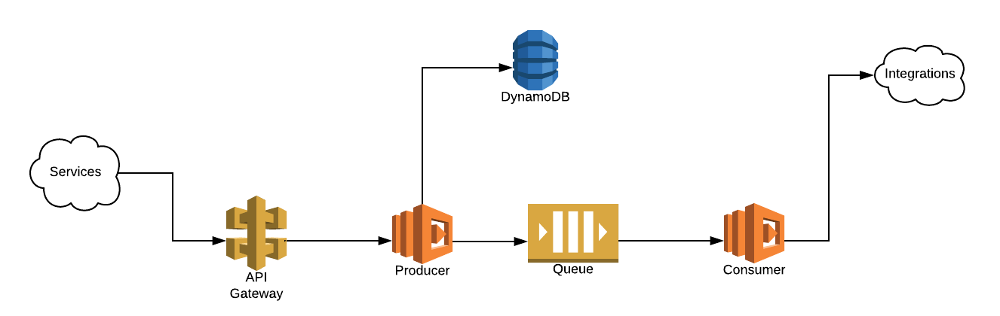

# Serverless Notification Service
A stack to manage notifications for multiple integrations.

## Motivation
The motivation for this, is a notification service using the concept of modern Serverless applications. Basically you have an *channel* with multiple *topics*. Every *topic* is a abstraction of a service like email, slack, telegram, etc.

## Architecture

The stack uses some AWS services, like Lambda Function, DynamoDB, SQS and API Gateway.

### API Gateway
Used for manage the incoming requests services. All request must be in the format above:

```shell
POST /v1/notifications/{channel}/{topic} HTTP/1.1
Host: xxxxxxxxxxx.execute-api.us-east-1.amazonaws.com
Content-Type: application/json
x-api-key: {api_key}
x-topic-hash-x: {topic_hash}
{
    "metadata": {
        "val1": "value one",
        "val2": "value two"
    }
}
```

Where:

- `channel`: Is the name of channel (string)
- `topic`: Is the name of topic in channel (string)
- `api_key`: The hash generated by AWS API Gateway
- `x-topic-hash-x`: The topic hash

From API Gateway, we can get two valid responses:

#### Success
The response is `200 OK` with a dictionary containing the integration name as key and the message id (Generated by SQS) as value

```shell
StatusCode: 200 OK
{
    "{integration_name1}": "{message_id}",
    "integration_name2}": "{message_id}"
}
```

#### Error
The response is `502 Bad Gateway` with the error message in node `message`

```shell
StatusCode: 502 Bad Gateway
{
    "message": "An error occurs while processing the request (Message: {error_message})"
}
```

### Lambda Function "Producer"
This function gets the notification request and create an `SQS Message` for every integration has mapped for this topic. This information is persisted in DynamoDB.

### DynamoDB Table
The model of DynamoDB Table is:
|    Id    |         Name      |  Integrations |
|----------|:-----------------:|--------------:|
|   UUID   | {channel}+{topic} | List of Integ |

Every document in DynamoDB is a topic with UUID and Name. The `Integration` node is a List containing:

- `model`: The format of message, containing the variables (format: `$variable`)
- `credentials`: Dictionary containing the data to access the integration
- `name`: The name of integration

### SQS Message
Every SQS Message has this format:

```json
 {
    "configuration": {
        "name": "integrationName",
        "credentials": {
            "url": "http://example.com",
            "authorization": "HASH"
        }
    },
    "message": "Example Message"
}
```

Where

- `configuration`: Dictionary containing the metadata for integrations (dictionary)
- `configuration.name`: Name of integration (string)
- `configuration.credentials`: Dictionary containing the metadata to access the integration (Dictionary)
- `message`: Message model with the variables replaced (string)

### Lambda Function "Consumer"
This function gets every message in SQS Queue and try sent to the specified integration.
If message cannot send, then, the message is marked with failed and the request will be retry in another time.

## Project Structure

    .
    ├── cf-notifications.yaml
    ├── producer/
    │   ├── handler.py
    |   |── core/
    |       |── ...
    ├── consumer/
    │   ├── handler.py
    |   |── integrations/
    |       |── ...

- `cf-notifications.yaml`: CloudFormation template
- `producer`: Producer Lambda Function
- `consumer`: Consumer Lambda Function

## Before Installing

Clone the repository:

```shell
$ git clone https://github.com/rubensmg/serverless-notifications
```

The `consumer` application needs the `request` lib, then, you can install using the command:

```shell
$ python3 -m pip install -r ./consumer/requirements.txt ./consumer
```

## Installing

Create a bucket in S3 (The bucket will be used to deploy the stack)

```shell
$ aws s3 create-bucket --bucket serverless.notifications --region us-east-1
```

Zip the producer/consumer application

```shell
$ zip -r producer ./producer/*
$ zip -r consumer ./consumer/* 
```

Upload the files

```shell
$ aws s3 cp ./producer.zip s3://serverless.notifications
$ aws s3 cp ./consumer.zip s3://serverless.notifications
$ aws s3 cp ./cf-notifications.zip s3://serverless.notifications
```

Run CloudFormation

```shell
$ aws cloudformation create-stack --stack-name NotificationService --template-body https://s3.amazonaws.com/serverless.notifications/cf-notifications.zip --parameters ParameterKey=ParamLambdaProducerS3DeployBucket,ParamValue=serverless.notifications,ParamKey=ParamLambdaProducerS3DeployKey,ParamValue=producer.zip,ParamKey=ParamLambdaProducerMemory,ParameterValue=128,ParamKey=ParamLambdaProducerTimeout,ParamValue=ParamKey=ParamLambdaConsumerS3DeployBucket,ParamValue=serverless.notifications,ParamKey=ParamLambdaConsumerS3DeployKey,ParamValue=consumer.zip,ParamKey=ParamLambdaConsumerMemory,ParamValue=128,ParamKey=ParamLambdaConsumerTimeout,ParamValue=1,ParamKey=ParamWriteCapacityUnitsTopic,ParamValue=1,ParamKey=ParamReadCapacityUnitsTopic,ParamValue=1
```
